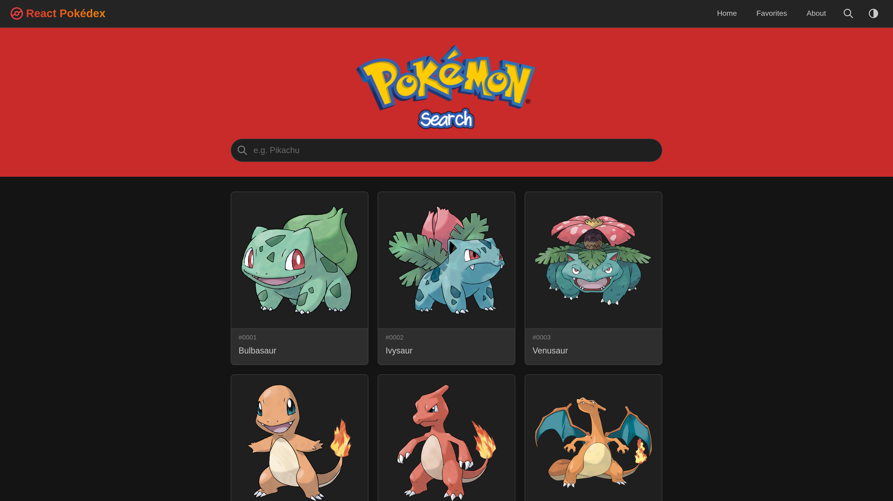
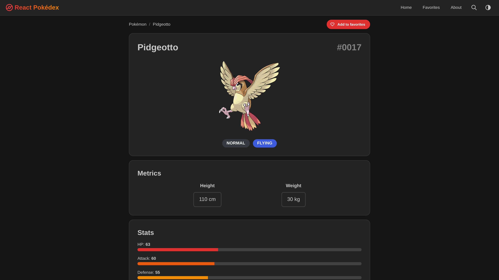
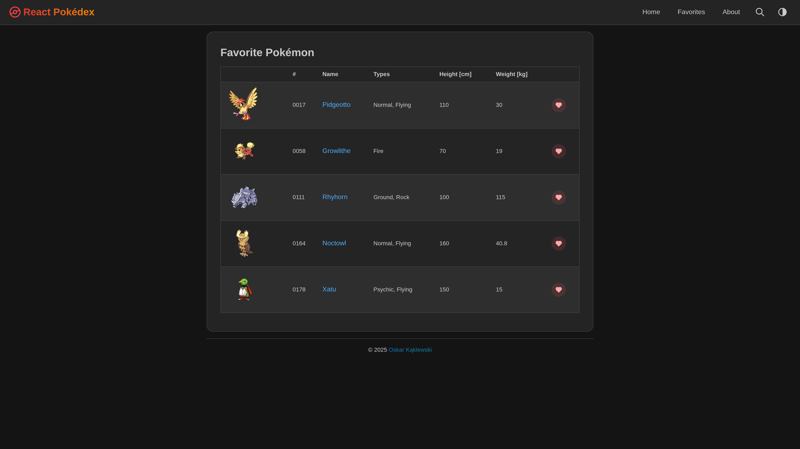
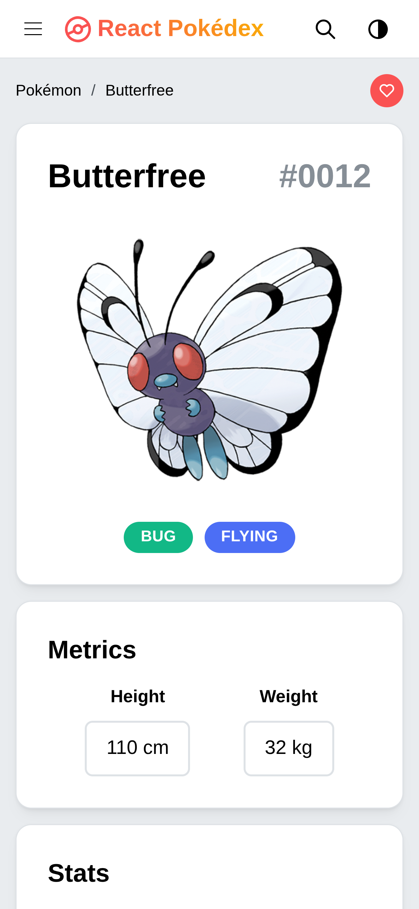

# React Pokédex

React Pokédex is a client-side application built as a sandbox for testing modern React libraries. It consumes the [PokéAPI](https://pokeapi.co/) and lets users browse Pokémon, view details, and manage a list of favorites.

## Live Demo

[View Live Demo](https://react-pokedex-2.netlify.app/)

### Screenshots

**Home page - dark theme**



**Pokémon profile - dark theme**



**Favorites - dark theme**



**Profile – light theme (mobile)**



## Features

- **Browse Pokémon** – list view with basic information.
- **Pokémon detail page** – stats, types, and additional data pulled from the PokéAPI.
- **Favorites** – mark Pokémon as favorites; favorites are stored in `localStorage`.
- **Search / Spotlight** – quick access to Pokémon using Mantine Spotlight.
- **Theme switcher** – light/dark theme toggle using Mantine.
- **Notifications** – feedback on user actions (e.g., adding/removing favorites).
- **Responsive UI** – layout optimized for both desktop and mobile devices.

## Tech Stack

**Core:**

- [Vite](https://vitejs.dev/) + [React](https://react.dev/)
- TypeScript

**Routing & data:**

- [TanStack Router](https://tanstack.com/router) – client-side routing
- [TanStack Query](https://tanstack.com/query) – data fetching, caching & synchronization
- [axios](https://axios-http.com/) – HTTP client for talking to the PokéAPI

**UI & UX:**

- [Mantine](https://mantine.dev/) – UI components, notifications, spotlight, and carousel
- [Framer Motion](https://www.framer.com/motion/) – animations and micro-interactions
- [Tabler Icons](https://tabler.io/icons) – icon set used across the app

**Testing:**

- [Vitest](https://vitest.dev/)
- [Testing Library](https://testing-library.com/) for React component testing

## Project Structure & Key Files

Some of the most relevant files in the project:

- **Project configuration**
    - [`package.json`](package.json)
    - [`vite.config.ts`](vite.config.ts)
    - [`tsconfig.app.json`](tsconfig.app.json)

- **Application entry**
    - [`src/main.tsx`](src/main.tsx)

- **Routing**
    - [`src/App.tsx`](src/App.tsx)
    - Auto-generated route tree: [`src/routeTree.gen.ts`](src/routeTree.gen.ts)

- **API layer**
    - [`src/api/pokemonApi.ts`](src/api/pokemonApi.ts)  
      Main helpers:
        - `fetchAllPokemon`
        - `fetchPokemonData`
        - `fetchMultiplePokemonData`

- **Example components**
    - [`src/components/FavButton.tsx`](src/components/FavButton.tsx)
    - [`src/components/ThemeSelect.tsx`](src/components/ThemeSelect.tsx)
    - [`src/components/PokemonSpotlight.tsx`](src/components/PokemonSpotlight.tsx)

- **Pages**
    - Home: [`src/pages/Home/HomePage.tsx`](src/pages/Home/HomePage.tsx)
    - Pokémon profile: [`src/pages/PokemonProfile/PokemonProfilePage.tsx`](src/pages/PokemonProfile/PokemonProfilePage.tsx)
    - Favorites: [`src/pages/Favorites/FavoritesPage.tsx`](src/pages/Favorites/FavoritesPage.tsx)

- **Tests (examples)**
    - [`src/api/pokemonApi.test.ts`](src/api/pokemonApi.test.ts)
    - [`src/components/FavButton.test.tsx`](src/components/FavButton.test.tsx)
    - [`src/components/ThemeSelect.test.tsx`](src/components/ThemeSelect.test.tsx)

## Getting Started

Clone the repository and install dependencies:

```bash
git clone https://github.com/kaklewski/react-pokedex.git
cd react-pokedex

# Install dependencies
npm install
```

By default, Vite will start the dev server on `http://localhost:5173` (or the next available port).

Run the app in development mode:

```bash
npm start
```

Build for production:

```bash
npm run build
```

Preview the production build:

```bash
npm run preview
```

## Running Tests

To run the test suite:

```bash
npm run test
```

## Future improvements

- Infinite scrolling or pagination for the Pokémon list
- More detailed stats and charts for Pokémon
- Sorting and filtering options for the Pokémon list
- i18n / localization support
- Backend integration / user accounts for syncing favorites across devices
